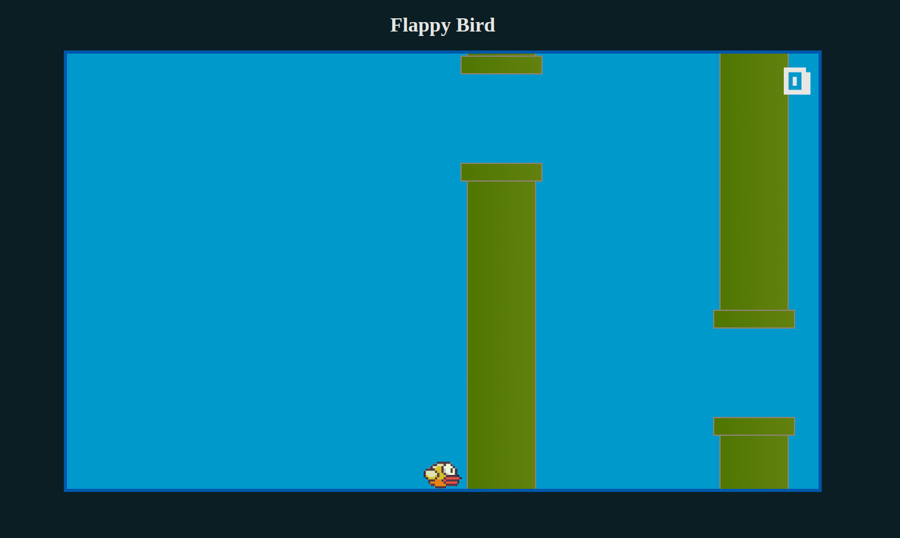

# Flap Birds Clone

## Contexto

Este projeto é uma simulação do famoso jogo Flappy Bird, desenvolvido utilizando tecnologias web.

## Especificações do Projeto

- **Tecnologias utilizadas:** HTML, CSS e JavaScript Vanilla.
- **Objetivo:** Criar um jogo simples e divertido que simula a mecânica de Flappy Bird.

## Estrutura do Projeto

A organização das pastas segue a seguinte estrutura:

```
  /audio     -> Contém arquivos de som utilizados no jogo (efeitos e músicas).
  /css       -> Contém os estilos CSS do jogo.
  /fonts     -> Contém fontes personalizadas utilizadas na interface.
  /imagens   -> Contém sprites e outras imagens do jogo.
  /js        -> Contém os arquivos JavaScript responsáveis pela lógica do jogo.
  index.html -> Arquivo principal que estrutura o jogo.
  README.md  -> Documentação do projeto.
```

## Regras do Jogo

- O jogador controla um pássaro que deve voar através de uma série de canos.
- O pássaro sobe ao clicar na tela ou pressionar uma tecla.
- O jogo termina se o pássaro tocar nos canos ou cair no chão.
- A pontuação aumenta conforme o jogador passa pelos obstáculos.

## Técnicas Utilizadas

- **Manipulação de Canvas API** para renderização dos elementos do jogo.
- **Eventos de teclado e mouse** para controle do pássaro.
- **Detecção de colisão** entre o pássaro e os obstáculos.
- **Gerenciamento de loops** para atualização da posição dos elementos.
- **Efeitos sonoros** para melhorar a experiência do usuário.

## Imagem Representativa do Jogo



---

Qualquer contribuição ou sugestão é bem-vinda!
